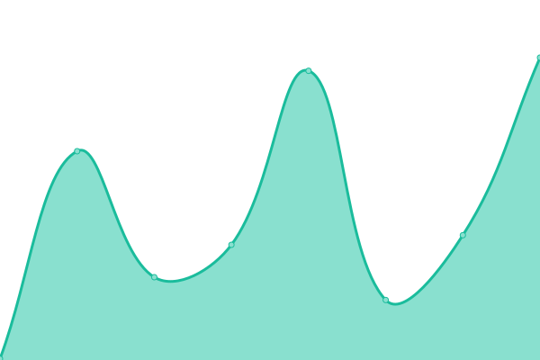
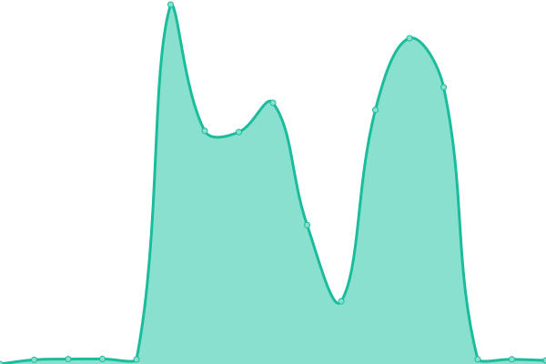
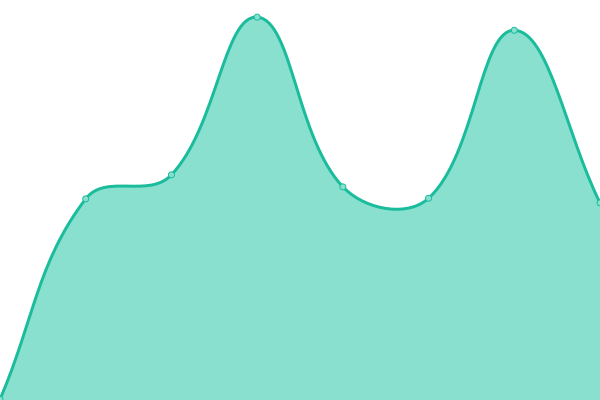
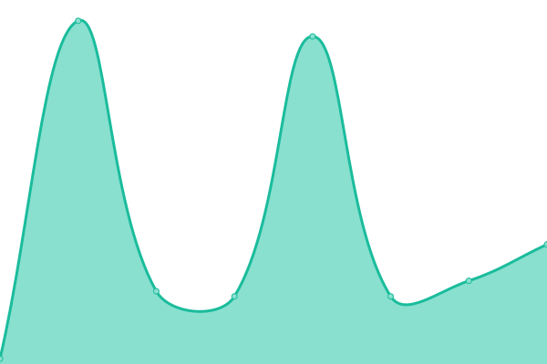
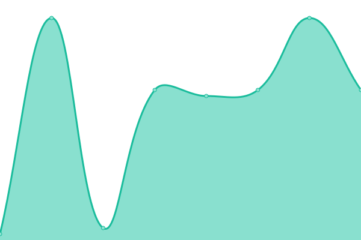
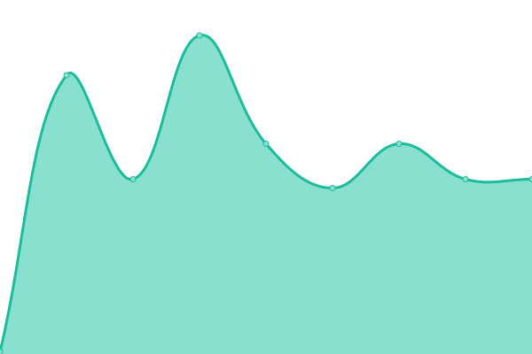
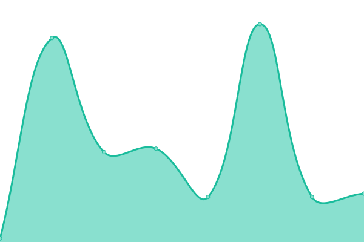
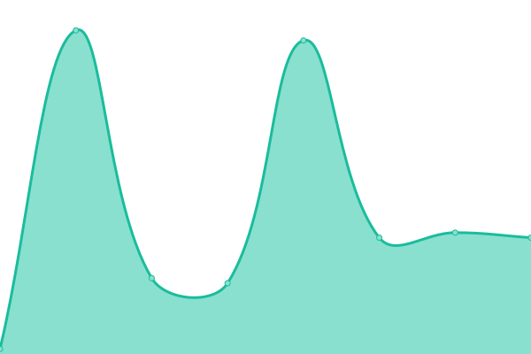

# [📈 Live Status](https://cake-tech.github.io/upptime): <!--live status--> **🟧 Partial outage**

This repository contains the open-source uptime monitor and status page for [Cake Labs LLC](cakewallet.com), powered by [Upptime](https://github.com/upptime/upptime).

With [Upptime](https://upptime.js.org), you can get your own unlimited and free uptime monitor and status page, powered entirely by a GitHub repository. We use [Issues](https://github.com/cake-tech/upptime/issues) as incident reports, [Actions](https://github.com/cake-tech/upptime/actions) as uptime monitors, and [Pages](https://cake-tech.github.io/upptime) for the status page.

<!--start: status pages-->
<!-- This summary is generated by Upptime (https://github.com/upptime/upptime) -->
<!-- Do not edit this manually, your changes will be overwritten -->
<!-- prettier-ignore -->
| URL | Status | History | Response Time | Uptime |
| --- | ------ | ------- | ------------- | ------ |
|  [cakewallet.com](https://cakewallet.com) | 🟩 Up | [cakewallet-com.yml](https://github.com/cake-tech/upptime-cakewallet/commits/HEAD/history/cakewallet-com.yml) | 

 124ms
     
 | 

<a href="https://status.cakewallet.com/history/cakewallet-com">100.00%</a>
    

|  [monero.com](https://monero.com) | 🟩 Up | [monero-com.yml](https://github.com/cake-tech/upptime-cakewallet/commits/HEAD/history/monero-com.yml) | 

 429ms
     
 | 

<a href="https://status.cakewallet.com/history/monero-com">98.54%</a>
    

|  [buy.cakepay.com](https://buy.cakepay.com) | 🟩 Up | [buy-cakepay-com.yml](https://github.com/cake-tech/upptime-cakewallet/commits/HEAD/history/buy-cakepay-com.yml) | 

 547ms
     
 | 

<a href="https://status.cakewallet.com/history/buy-cakepay-com">99.92%</a>
    

|  [xmr-node.cakewallet.com:18081](xmr-node.cakewallet.com) | 🟥 Down | [xmr-node-cakewallet-com-18081.yml](https://github.com/cake-tech/upptime-cakewallet/commits/HEAD/history/xmr-node-cakewallet-com-18081.yml) | 

 32ms
     
 | 

<a href="https://status.cakewallet.com/history/xmr-node-cakewallet-com-18081">87.83%</a>
    

|  [electrum.cakewallet.com:50002](electrum.cakewallet.com) | 🟩 Up | [electrum-cakewallet-com-50002.yml](https://github.com/cake-tech/upptime-cakewallet/commits/HEAD/history/electrum-cakewallet-com-50002.yml) | 

 28ms
     
 | 

<a href="https://status.cakewallet.com/history/electrum-cakewallet-com-50002">100.00%</a>
    

|  [ltc-electrum.cakewallet.com:50002](ltc-electrum.cakewallet.com) | 🟥 Down | [ltc-electrum-cakewallet-com-50002.yml](https://github.com/cake-tech/upptime-cakewallet/commits/HEAD/history/ltc-electrum-cakewallet-com-50002.yml) | 

 93ms
     
 | 

<a href="https://status.cakewallet.com/history/ltc-electrum-cakewallet-com-50002">83.16%</a>
    

|  [Exchange Helper](https://exchange-helper.cakewallet.com/api/health) | 🟩 Up | [exchange-helper.yml](https://github.com/cake-tech/upptime-cakewallet/commits/HEAD/history/exchange-helper.yml) | 

 186ms
     
 | 

<a href="https://status.cakewallet.com/history/exchange-helper">100.00%</a>
    

|  XMR Asia Servers | 🟥 Down | [xmr-asia-servers.yml](https://github.com/cake-tech/upptime-cakewallet/commits/HEAD/history/xmr-asia-servers.yml) | 

 32ms
     
 | 

<a href="https://status.cakewallet.com/history/xmr-asia-servers">89.29%</a>
    

|  XMR EU Servers | 🟩 Up | [xmr-eu-servers.yml](https://github.com/cake-tech/upptime-cakewallet/commits/HEAD/history/xmr-eu-servers.yml) | 

 102ms
     
 | 

<a href="https://status.cakewallet.com/history/xmr-eu-servers">99.93%</a>
    

|  XMR USA Servers | 🟥 Down | [xmr-usa-servers.yml](https://github.com/cake-tech/upptime-cakewallet/commits/HEAD/history/xmr-usa-servers.yml) | 

 31ms
     
 | 

<a href="https://status.cakewallet.com/history/xmr-usa-servers">90.27%</a>
    

<!--end: status pages-->

[**Visit our status website →**](https://cake-tech.github.io/upptime)

## 📄 License

- Powered by: [Upptime](https://github.com/upptime/upptime)
- Code: [MIT](./LICENSE) © [Cake Labs LLC](cakewallet.com)
- Data in the `./history` directory: [Open Database License](https://opendatacommons.org/licenses/odbl/1-0/)
